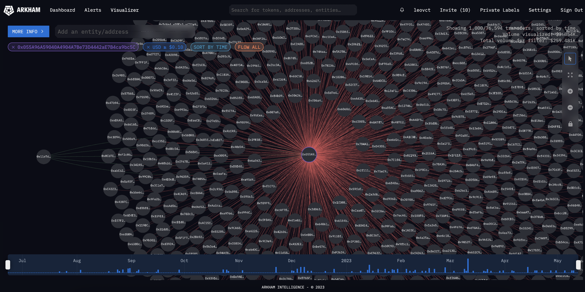

# 📈 Fee Spikes on Polygon around March 21/22 of 2023

## Introduction

We received some inquiries about user transactions going up to 4+ Matic in fees when the median average fees should have been around 0.05 MATIC in the middle of March 2023. We decided to investigate to identify the root cause of the fee spikes and to find a way to solve the issue in order to ensure that Polygon remains cheap and usable. The investigation targeted a 40-hour period between 2023-03-21 00:00:00 and 2023-03-22 17:45:50.

The Polygon team identified that only a very small percentage (< 0.03%) of transactions were priced above 4 Matic in fees. Indeed, most of the other transactions were priced correctly. By filtering down, removing successful transactions and only looking at transactions that were priced at 1 Matic or more, we could see that there were around 1 340 failed transactions and 98% of these transactions came from the same [smart contract](https://polygonscan.com/address/0x458df878cae2174a294b907df6d4235fa59eaa44). This contract was overpaying for gas, running exhaustion and utilizing a lot of space in blocks. Suspicious right?

## The suspicious smart contract

We tried to understand what was the [smart contract](https://polygonscan.com/address/0x458df878cae2174a294b907df6d4235fa59eaa44) doing using tools such as [PolygonScan](https://polygonscan.com/), [Tenderly](https://dashboard.tenderly.co/) and [Arkham Intelligence](https://platform.arkhamintelligence.com/). It became quite clear that this was an arbitrage smart contract that purchased assets on DEXes offering a lower price and sold it on other exchanges, offering a higher price, bringing both exchange prices back to equilibrium while earning a profit called [MEV](#mev-digression). The top functions called were `arbV3Iterative3`, `uniswapV3SwapCallback`, `jetswapCall`, `waultSwapCall`, etc.

The person behind the contract deployed a proxy smart contract to be able to update the bytecode of the arbitrage smart contract without changing the address. He then funded multiple bots accounts with MATIC that interacted with the arbitrage smart contract. These bots all competed, and still compete against, each other by sending the same transactions, at the same time, with the same parameters, to the arbitrage smart contract. Here are a few instances of these bots: found [here](https://polygonscan.com/address/0xaa1ca302d7c7a38e580ac10597e0ae0fbe205e35), [here](https://polygonscan.com/address/0xe852bb09195e6f4172eaac193bc2ea42ad7117e4), and [here](https://polygonscan.com/address/0x570d5d35bd8b55db090de1d9041055e3134bce1f).

Here's a [visual representation](https://platform.arkhamintelligence.com/visualizer/0x055A96A59040A4904A7Be73D4442aE7B4ca9bc5C) of all the interactions between the arbitrage smart contract (in the middle) and the army of bots.

> But why was this smart contract spamming expensive transactions on the network?

It looks like [Flashbots](https://www.flashbots.net/) are not used on Polygon so most of the MEV on Polygon resolves into [Priority Gas Auctions](https://www.mev.wiki/terms-and-concepts/priority-gas-auctions) (PGAs) which means that bots compete against each other by bidding up transaction fees (gas) which drives fees for other users. This is considered "bad" MEV because it impacts users negatively, causing huge gas spikes on the network. Indeed, spamming transactions is a winning strategy on Polygon since the throughput is high and the transaction fees are low.

(cool repo experimenting with this idea).

Many DeFi projects such as DEXes rely on economically rational actors, such as DEX arbitrage bots, to ensure that users get the best prices for their tokens.

It looks like Flashbots are not used that much on Polygon so most of MEV resolves into Priority Gas Auctions (PGAs), which is also called front-running or “bad” MEV. Why is it labeled as bad?

Second, I wanted to understand more about MEV and Flashbots so I went down the rabbit hole, that was fun. This is a very good resource to getting started and it’s quite short. Back to the findings, it looks like Flashbots are not used on Polygon so most of MEV resolves into Priority Gas Auctions (PGAs), which is also called front-running or “bad” MEV. These cause huge gas spikes on the network as we saw because spamming transactions is a winning strategy on Polygon since the throughput is high and the transaction fees are low (cool repo experimenting with this idea).
Some potential solutions would be to quantify the impact of MEV on Polygon and also push the adoption of Flashbots on Polygon to separate the roles of block-builder (who decides the order of txs in a block) from the role of block-proposer (who adds the block to the chain) as it has been done on Ethereum. Bots will have a dedicated channel to make their bids, this will reduce the number of spam transactions on the network and this will also encourage the use of good MEV which is better for DeFi users especially.
Some interesting links if you’re interested:
Marlin research on the impact of MEV on Polygon: https://blog.marlin.org/introducing-mev-support-for-polygon
Flash Babies, analysis of MEV on L2 (including Polygon): https://timroughgarden.github.io/fob21/reports/r11.pdf
Flashbot Research Proposal on quantifying the impact of MEV on L2s: https://collective.flashbots.net/t/frp-24-quantifying-mev-on-l2s/450

### MEV digression

Wait, what does MEV mean? MEV stands for Maximal Extractable Value which refers to "the maximum value that can be extracted from block production in excess of the standard block reward and gas fees by including, excluding, and changing the order of transactions in a block", credits to [ethereum.org](https://ethereum.org/en/developers/docs/mev/) for the definition. Before [The Merge](https://ethereum.org/en/roadmap/merge/) on Ethereum, MEV was initially called "Miner Extractable Value" because Ethereum was utilizing a proof-of-work consensus mechanism instead of proof-of-stake, and individuals responsible for validating transactions were known as miners at that time.

There are different forms of MEV, including DEX arbitrage, liquidations, sandwich trading, NFT MEV, etc. While we won't go over each of these in detail, let's focus on arbitrage to gain a better understanding of MEV. Suppose there are two decentralized exchanges (DEXes) offering a particular token at different prices. In this scenario, a bot can execute a single atomic transaction by purchasing the token on the lower-priced DEX and selling it on the higher-priced DEX, thereby generating a profit.

To illustrate this concept further, consider this [real example](https://etherscan.io/tx/0x5e1657ef0e9be9bc72efefe59a2528d0d730d478cfc9e6cdd09af9f997bb3ef4) where someone utilized a flash loan of 1000 ether from Aave. They then exchanged the borrowed ether for 1,293,896 DAI on Uniswap to convert this amount of DAI back into 1,045 ether. Finally, they repaid the flash loan, all within the same transaction. This sequence of actions resulted in a profit of 45 ether, which, given that ether was valued around $2,000, translates to a profit of $90,000. Quite impressive!
