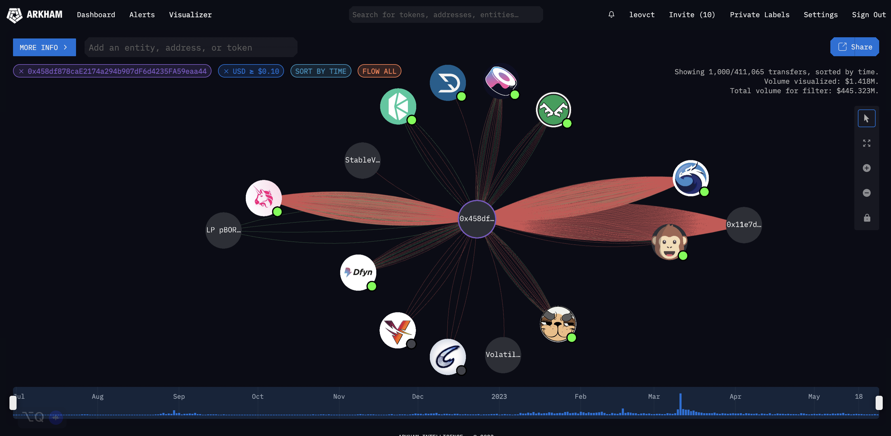
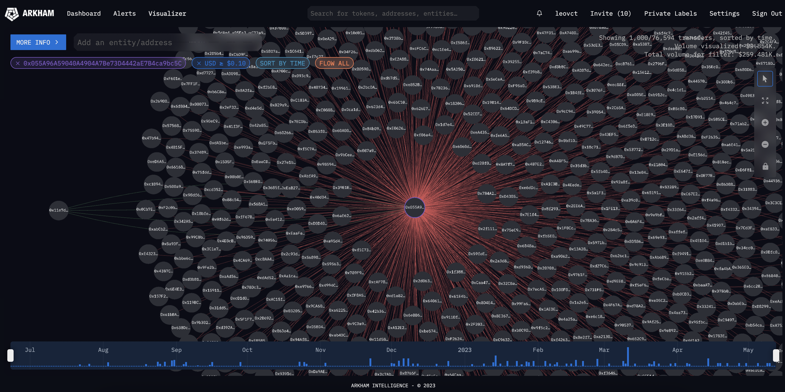
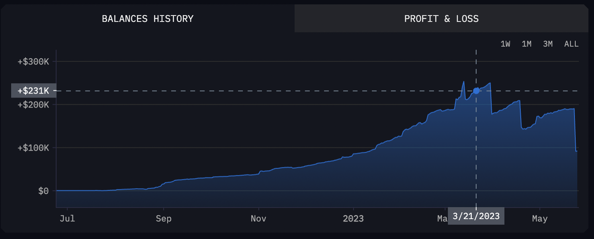
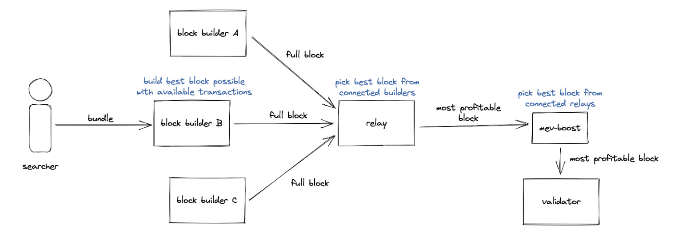

# 📈 Gas Fee Spikes Analysis

## Table of contents

- [Introduction](#introduction)
- [Gas fee spikes analysis](#gas-fee-spikes-analysis)
- [A suspicious smart contract](#a-suspicious-smart-contract)
- [Conclusion](#conclusion)

## Introduction

We received some inquiries about user transactions going up to 4+ Matic in fees when the median average fees should have been around 0.05 MATIC in the middle of March 2023. We decided to investigate to identify the root cause of the fee spikes and find a way to solve the issue in order to ensure that Polygon remains cheap and usable. The investigation targeted a 40-hour period between 2023-03-21 00:00:00 and 2023-03-22 17:45:50.

The Polygon team identified that only a very small percentage (< 0.03%) of transactions were priced above 4 Matic in fees. Indeed, most of the other transactions were priced correctly. By filtering down, removing successful transactions and only looking at transactions that were priced at 1 Matic or more, we could see that there were around 1,340 failed transactions and 98% of these transactions came from the same [smart contract](https://polygonscan.com/address/0x458df878cae2174a294b907df6d4235fa59eaa44). This contract was overpaying for gas, running exhaustion and utilizing a lot of space in blocks. Suspicious right? Let's dive in...

## Gas fee spikes analysis

TODO + also talk about EIP-1559

## A suspicious smart contract

We started our analysis using tools such as [PolygonScan](https://polygonscan.com/), [Tenderly](https://dashboard.tenderly.co/) and [Arkham Intelligence](https://platform.arkhamintelligence.com/). The findings indicated that the smart contract in question was involved in arbitrage activities. It would acquire assets from decentralized exchanges (DEXes) at lower prices and then sell them on other exchanges at higher prices, bringing both exchange prices back to equilibrium while earning a profit. The primary functions invoked in this contract were `arbV3Iterative3`, `uniswapV3SwapCallback`, `jetswapCall`, `waultSwapCall`, etc., leaving no room for ambiguity regarding the contract's purpose.

Here, you can see all the interactions between the arbitrage smart contract and various DeFi protocols, including [Uniswap](https://uniswap.org/) and [SushiSwap](https://www.sushi.com/).

The [individual](https://polygonscan.com/address/0x11e7dbE4bDFEDa568Eca05D36BA4aEE634aEAa71) responsible for deploying the smart contract also deployed a [proxy](https://polygonscan.com/address/0xd72e4bfe543568ca0645b47bad2b05276ccd724d) contract. This proxy contract enabled them to update the bytecode of the arbitrage smart contract without changing its address. Additionally, he funded multiple bot accounts with MATIC, which interacted with the arbitrage smart contract. These bots competed against each other by sending identical transactions with the same parameters to the arbitrage smart contract simultaneously. Here are a few examples of these bots: found [here](https://polygonscan.com/address/0xaa1ca302d7c7a38e580ac10597e0ae0fbe205e35), [here](https://polygonscan.com/address/0xe852bb09195e6f4172eaac193bc2ea42ad7117e4), and [here](https://polygonscan.com/address/0x570d5d35bd8b55db090de1d9041055e3134bce1f). By the way, these bots are still actively operating on Polygon PoS.

A visual representation of the network of bots can be seen [here](https://platform.arkhamintelligence.com/visualizer/0x055A96A59040A4904A7Be73D4442aE7B4ca9bc5C). The MATIC dispenser smart contract is positioned in the center, surrounded by an "army" of bots, while the account owner can be identified on the left side. This strongly echoes the [Dark Forest](https://www.paradigm.xyz/2020/08/ethereum-is-a-dark-forest) concept as described by G. Konstantopoulos, portraying the Ethereum mempool as a fierce battleground where competing bots engage in relentless competition.

This strategy has proven to be highly profitable, indeed, these bots managed to extract around $230k in a few months! Unfortunately, the smart contract is not verified on PolygonScan so the inner workings of the smart contract remain unclear. One approach to gaining insights into its implementation would involve decompiling the [bytecode](https://polygonscan.com/address/0x458df878cae2174a294b907df6d4235fa59eaa44#code), which can be done using tools like [Dedaub](https://library.dedaub.com/decompile). Though, even if the contract can be decompiled, understanding the logic behind it can be highly complex.

> But why was this smart contract spamming expensive transactions on the network?

That's a great reason to dive into the [MEV](#mev-digression) rabbit hole! 🐇

Fasten your seat belt, this is going to be fun!

Wait, what does MEV mean? MEV stands for Maximal Extractable Value which refers to "the maximum value that can be extracted from block production in excess of the standard block reward and gas fees by including, excluding, and changing the order of transactions in a block", credits to [ethereum.org](https://ethereum.org/en/developers/docs/mev/) for the definition. Before [The Merge](https://ethereum.org/en/roadmap/merge/) on Ethereum, MEV was initially called "Miner Extractable Value" because Ethereum was utilizing a proof-of-work consensus mechanism instead of proof-of-stake, and individuals responsible for validating transactions were known as miners at that time.

There are different forms of MEV, including DEX arbitrage, liquidations, sandwich trading, NFT MEV, etc. While we won't go over each of these in detail, let's focus on arbitrage to gain a better understanding of MEV. Suppose there are two decentralized exchanges (DEXes) offering a particular token at different prices. In this scenario, a bot can execute a single atomic transaction by purchasing the token on the lower-priced DEX and selling it on the higher-priced DEX, thereby generating a profit. To illustrate this concept further, consider this [real example](https://etherscan.io/tx/0x5e1657ef0e9be9bc72efefe59a2528d0d730d478cfc9e6cdd09af9f997bb3ef4) where someone utilized a flash loan of 1000 ether from Aave. They then exchanged the borrowed ether for 1,293,896 DAI on Uniswap to convert this amount of DAI back into 1,045 ether. Finally, they repaid the flash loan, all within the same transaction. This sequence of actions resulted in a profit of 45 ether, which, given that ether was valued around $2,000, translates to a profit of $90,000. Quite impressive!

Coming back to our suspicious smart contract spamming transactions. On Polygon, and other layers 2 blockchains, without the existence and the adoption of solutions like [Flashbots](https://www.flashbots.net/) by the validators, most of the MEV activity resolves into [Priority Gas Auctions](https://www.mev.wiki/terms-and-concepts/priority-gas-auctions). PGAs create a competitive environment where bots compete against each other by bidding up transaction fees (gas) which drives fees for other users. This is considered "bad" MEV because it impacts users negatively, causing huge gas spikes on the network. MEV is not all bad, some MEV activities are useful for DeFi projects as well as users such as arbitraging MEV, to ensure that users get the best prices for their tokens. Since the throughput is high and the transaction fees are low on Polygon, spamming transactions is a winning strategy.

Some potential solutions would be to quantify the impact of MEV on Polygon, like it has been done [here](https://collective.flashbots.net/t/frp-24-quantifying-mev-on-l2s/450) and [here](https://timroughgarden.github.io/fob21/reports/r11.pdf), and also push the adoption of Flashbots or same-order solutions on Polygon such as [mev-bor](https://github.com/marlinprotocol/mev-bor) and [Fastlane](https://www.fastlane.finance/). Why is it important? In proof-of-work and proof-of-stake systems, miners and validators have the power to manipulate the order of transactions to their advantage, potentially extracting additional value from the transactions, before a block is added to the blockchain. The [Proposer-Builder Separation](https://ethereum.org/en/developers/docs/mev/#proposer-builder-separation) (PBS) concept aims to mitigate this by separating the decision-making process of transaction ordering from the block proposal process. By separating these stages, the goal is to reduce the influence of miners or validators in manipulating the order of transactions and capturing additional value, ensuring a fairer and more secure blockchain ecosystem. Bots will have a dedicated channel to make their bids, which will reduce the number of spam, front-running and sandwiching transactions on the network and this will also encourage the use of good MEV which is better for users.

Credits to [Dom Steil](https://domsteil.substack.com/p/proposer-builder-separation-pbs) for the illustration of the PBS concept.

## Conclusion

TODO
