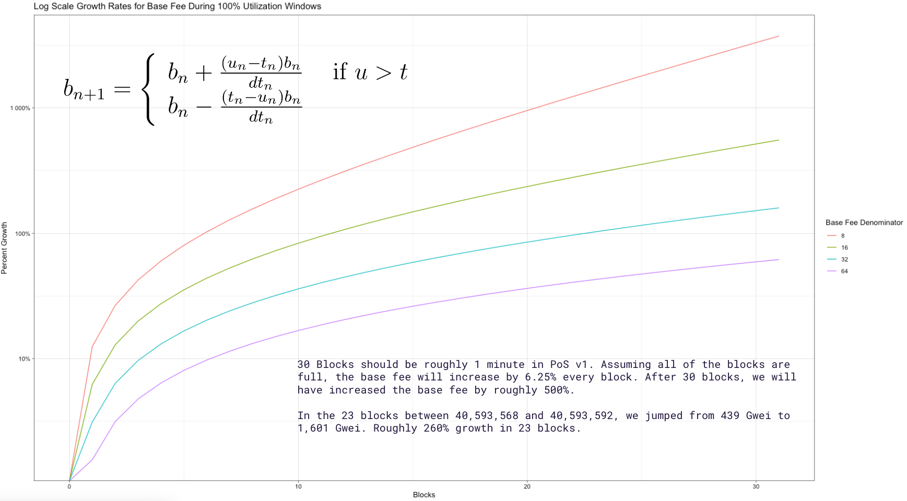

# 📈 Gas Fee Spikes Analysis

## Table of contents

- [Introduction](#introduction)
- [Gas fee spikes analysis](#gas-fee-spikes-analysis)
- [Base fee mechanics of EIP-1559 on Polygon](#base-fee-mechanics-of-eip-1559-on-polygon)
- [Conclusion](#conclusion)

## Introduction

We received some inquiries about user transactions going up to 4+ Matic in fees when the median average fees should have been around 0.05 MATIC in the middle of March 2023. We decided to investigate to identify the root cause of the fee spikes and find a way to solve the issue in order to ensure that Polygon remains cheap and usable.

## Gas fee spikes analysis

The investigation targeted a 40-hour period between 2023-03-21 00:00:00 and 2023-03-22 17:45:50. The Polygon team identified that only a very small percentage (< 0.03%) of transactions were priced above 4 Matic in fees. Indeed, most of the other transactions were priced correctly.

  Fig 1. Gas fee distribution

When using a wider aperture, we can see that high fees are rare. By narrowing down and focusing on time ranges when the fees are high, we can get some interesting insights. In this visual, each dot is a transaction. The blue dots were successful, and the red dots were failures. What stands out most are the inorganic and unnatural-looking failures. Those transactions are being priced unusually.

  Fig 2. Fees paid per transaction over time by status

By filtering down, removing successful transactions and only looking at transactions that were priced at 1 Matic or more, we could see that there were around 1,340 failed transactions and 98% of these transactions came from the same [smart contract](https://polygonscan.com/address/0x458df878cae2174a294b907df6d4235fa59eaa44). This contract was overpaying for gas, running exhaustion and utilizing a lot of space in blocks. Suspicious right? Let's dive in...

  Fig 3. Fees paid per transaction over time and filtered to only keep suspicious transactions

To understand what was the smart contract doing, we used investigation tools such as [PolygonScan](https://polygonscan.com/), [Tenderly](https://dashboard.tenderly.co/) and [Arkham Intelligence](https://platform.arkhamintelligence.com/). The findings indicated that the smart contract in question was involved in arbitrage activities. It would acquire assets from decentralized exchanges (DEXes) at lower prices and then sell them on other exchanges at higher prices, bringing both exchange prices back to equilibrium while earning a profit. The primary functions invoked in this contract were `arbV3Iterative3`, `uniswapV3SwapCallback`, `jetswapCall`, `waultSwapCall`, etc., leaving no room for ambiguity regarding the contract's purpose.

Here, you can see all the interactions between the arbitrage smart contract and various DeFi protocols, including [Uniswap](https://uniswap.org/) and [SushiSwap](https://www.sushi.com/).

  Fig 4. Interactions between the arbitrage smart contract and DeFi protocols

The [individual](https://polygonscan.com/address/0x11e7dbE4bDFEDa568Eca05D36BA4aEE634aEAa71) responsible for deploying the smart contract also deployed a [proxy](https://polygonscan.com/address/0xd72e4bfe543568ca0645b47bad2b05276ccd724d) contract. This proxy contract enabled them to update the bytecode of the arbitrage smart contract without changing its address. Additionally, he funded multiple bot accounts with MATIC, which interacted with the arbitrage smart contract. These bots competed against each other by sending identical transactions with the same parameters to the arbitrage smart contract simultaneously. Here are a few examples of these bots: found [here](https://polygonscan.com/address/0xaa1ca302d7c7a38e580ac10597e0ae0fbe205e35), [here](https://polygonscan.com/address/0xe852bb09195e6f4172eaac193bc2ea42ad7117e4), and [here](https://polygonscan.com/address/0x570d5d35bd8b55db090de1d9041055e3134bce1f). By the way, these bots are still actively operating on Polygon PoS.

  Fig 5. Arbitrage setup on Polygon

A visual representation of the network of bots can be seen [here](https://platform.arkhamintelligence.com/visualizer/0x055A96A59040A4904A7Be73D4442aE7B4ca9bc5C). The MATIC dispenser smart contract is positioned in the center, surrounded by an "army" of bots, while the account owner can be identified on the left side. This strongly echoes the [Dark Forest](https://www.paradigm.xyz/2020/08/ethereum-is-a-dark-forest) concept as described by G. Konstantopoulos, portraying the Ethereum mempool as a fierce battleground where competing bots engage in relentless competition.

  Fig 6. An army of bots

This strategy has proven to be highly profitable, indeed, these bots managed to extract around $230k in a few months! Unfortunately, the smart contract is not verified on PolygonScan so the inner workings of the smart contract remain unclear. One approach to gaining insights into its implementation would involve decompiling the [bytecode](https://polygonscan.com/address/0x458df878cae2174a294b907df6d4235fa59eaa44#code), which can be done using tools like [Dedaub](https://library.dedaub.com/decompile). Though, even if the contract can be decompiled, understanding the logic behind it can be highly complex.

  Fig 7. Arbitrage strategy profits

> But why was this smart contract spamming expensive transactions on the network?

That's a great reason to dive into the [MEV](#mev-digression) rabbit hole! 🐇

Fasten your seat belt, this is going to be fun!

Wait, what does MEV mean? MEV stands for Maximal Extractable Value which refers to "the maximum value that can be extracted from block production in excess of the standard block reward and gas fees by including, excluding, and changing the order of transactions in a block", credits to [ethereum.org](https://ethereum.org/en/developers/docs/mev/) for the definition. Before [The Merge](https://ethereum.org/en/roadmap/merge/) on Ethereum, MEV was initially called "Miner Extractable Value" because Ethereum was utilizing a proof-of-work consensus mechanism instead of proof-of-stake, and individuals responsible for validating transactions were known as miners at that time.

There are different forms of MEV, including DEX arbitrage, liquidations, sandwich trading, NFT MEV, etc. While we won't go over each of these in detail, let's focus on arbitrage to gain a better understanding of MEV. Suppose there are two decentralized exchanges (DEXes) offering a particular token at different prices. In this scenario, a bot can execute a single atomic transaction by purchasing the token on the lower-priced DEX and selling it on the higher-priced DEX, thereby generating a profit. To illustrate this concept further, consider this [real example](https://etherscan.io/tx/0x5e1657ef0e9be9bc72efefe59a2528d0d730d478cfc9e6cdd09af9f997bb3ef4) where someone utilized a flash loan of 1000 ether from Aave. They then exchanged the borrowed ether for 1,293,896 DAI on Uniswap to convert this amount of DAI back into 1,045 ether. Finally, they repaid the flash loan, all within the same transaction. This sequence of actions resulted in a profit of 45 ether, which, given that ether was valued around $2,000, translates to a profit of $90,000. Quite impressive!

Coming back to our suspicious smart contract spamming transactions. On Polygon, and other layers 2 blockchains, without the existence and the adoption of solutions like [Flashbots](https://www.flashbots.net/) by the validators, most of the MEV activity resolves into [Priority Gas Auctions](https://www.mev.wiki/terms-and-concepts/priority-gas-auctions). PGAs create a competitive environment where bots compete against each other by bidding up transaction fees (gas) which drives fees for other users. This is considered "bad" MEV because it impacts users negatively, causing huge gas spikes on the network. MEV is not all bad, some MEV activities are useful for DeFi projects as well as users such as arbitraging MEV, to ensure that users get the best prices for their tokens. Since the throughput is high and the transaction fees are low on Polygon, spamming transactions is a winning strategy.

Some potential solutions would be to quantify the impact of MEV on Polygon, like it has been done [here](https://collective.flashbots.net/t/frp-24-quantifying-mev-on-l2s/450) and [here](https://timroughgarden.github.io/fob21/reports/r11.pdf), and also push the adoption of Flashbots or same-order solutions on Polygon such as [mev-bor](https://github.com/marlinprotocol/mev-bor) and [Fastlane](https://www.fastlane.finance/). Why is it important? In proof-of-work and proof-of-stake systems, miners and validators have the power to manipulate the order of transactions to their advantage, potentially extracting additional value from the transactions, before a block is added to the blockchain. The [Proposer-Builder Separation](https://ethereum.org/en/developers/docs/mev/#proposer-builder-separation) (PBS) concept aims to mitigate this by separating the decision-making process of transaction ordering from the block proposal process. By separating these stages, the goal is to reduce the influence of miners or validators in manipulating the order of transactions and capturing additional value, ensuring a fairer and more secure blockchain ecosystem. Bots will have a dedicated channel to make their bids, which will reduce the number of spam, front-running and sandwiching transactions on the network and this will also encourage the use of good MEV which is better for users.

  Fig 8. PBS illustrated <a href="https://domsteil.substack.com/p/proposer-builder-separation-pbs">(Dom Steil)</a>

## Base fee mechanics of EIP-1559 on Polygon

The other topic we dug into was the base fee mechanics of [EIP-1559](https://eips.ethereum.org/EIPS/eip-1559).

This EIP simplifies Ethereum's fee market. Previously, gas fees were calculated via a price-first auction method. Users would bid an amount of ether for miners/validators to validate their transactions. Since miners/validators' goal is to make a profit, the higger bidder would always win. This would lead to massive inefficiencies. Gas fees were heavily volatile depending on how congested the network was. Users would have to wait multiple blocks before seeing their transaction included in a block. And it was very challenging to predict how much fees you would pay. In the end, most users would overpay for gas, introducing elements of instability. The UX was very very bad.

EIP-1559 splits fees into two parts, base fee and priority fee (or tip). The base fee is the amount required to get your transaction introduced in the next block. It is adjusted algorithmically based on network congestion by ±12.5%, which makes fees more predictable. The priority fee is an optional fee that incentivizes a miner to verify a transaction sooner during times of high congestion. Note that the miner/validator only receives the priority fee. Indeed, the base fee is burned, understand removed from the total ether supply.

This resulted in significant improvement in fee stability as illustrated by this graph.

  Fig 9. Gas fee price before and after EIP-1559 <a href="https://www.reddit.com/r/ethereum/comments/pc21y4/did_eip1559_work_heres_transaction_fees_before/">(r/ethereum)</a>

The formula to compute the next base fee is a geometrical sequence with:

- `b` as the base fee (`b_n+1` for the base fee of the next block and `b_n` for the base fee of the previous block),
- `u` as the total amount of gas used in the current block,
- `t` as the target amount of gas for a block divided by the elasticity multiplier coefficient (set to 2 on both [Ethereum](https://eips.ethereum.org/EIPS/eip-1559) and [Polygon PoS](https://github.com/maticnetwork/bor/blob/develop/params/protocol_params.go#LL125C3-L125C3)),
- `d` as the base fee change denominator (set to 8 on [Ethereum](https://eips.ethereum.org/EIPS/eip-1559) and 16 on [Polygon PoS](https://github.com/maticnetwork/bor/blob/develop/params/protocol_params.go#L123) after the Delhi hard fork).

  Fig 11. Base fee formula

Assuming that blocks are fully utilized on Polygon PoS (`d=8` and  `t_n=u_n/2`), we have `b_n+1=(17/16)*b_n`. This means that base fees swings between ±6.25% as we can see in the following diagram.

  Fig 12. Change in base fee

The Polygon team uncovered that in a ~20 block period, the base fee jumped from 439 Gwei to 1,601 Gwei. This is something we can see in the first red incline of the third figure. Given that each block on Polygon PoS can increase the base by 6.25%. When blocks are fully utilized, like what this smart contract was doing, the base fee could increase by 500% in about 1 minute.

  Fig 10. Base fee growth rate when blocks are fully utilized

A solution could be to try to prevent the base fee from increasing and decreasing too rapidly. Since we produce blocks around 6 times faster than Ethereum (around 12s for Ethereum block time and 2s for Polygon PoS), we may want to decrease our `ElasticityMultiplier` or increase our `BaseFeeChangeDenominator` to dampen these swings.

## Conclusion

TODO
