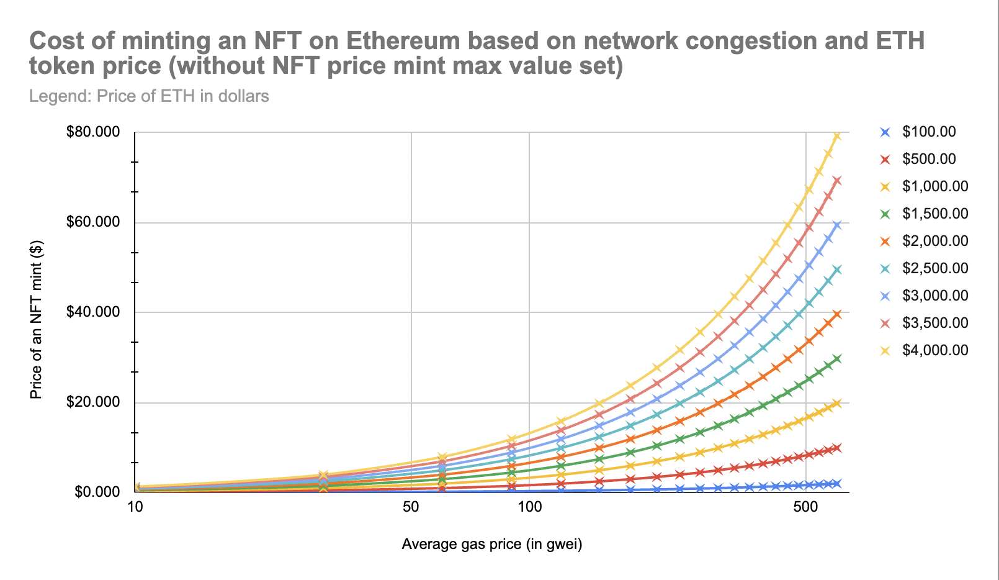
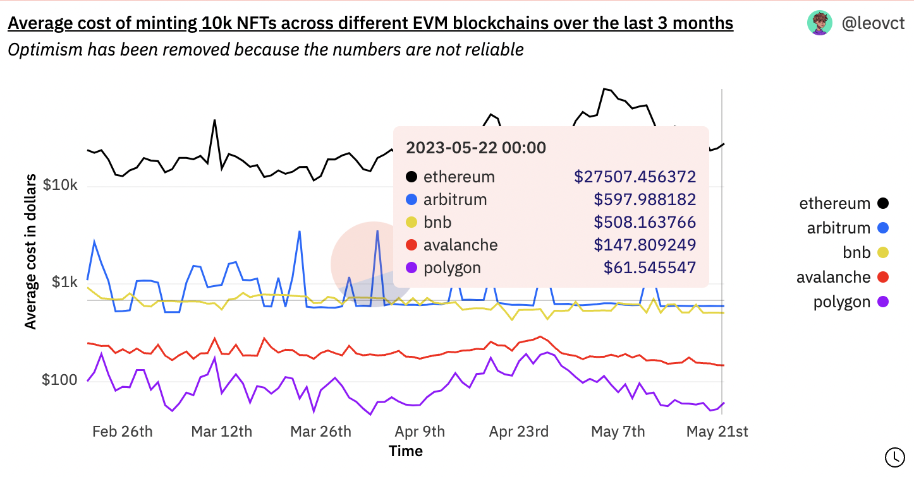
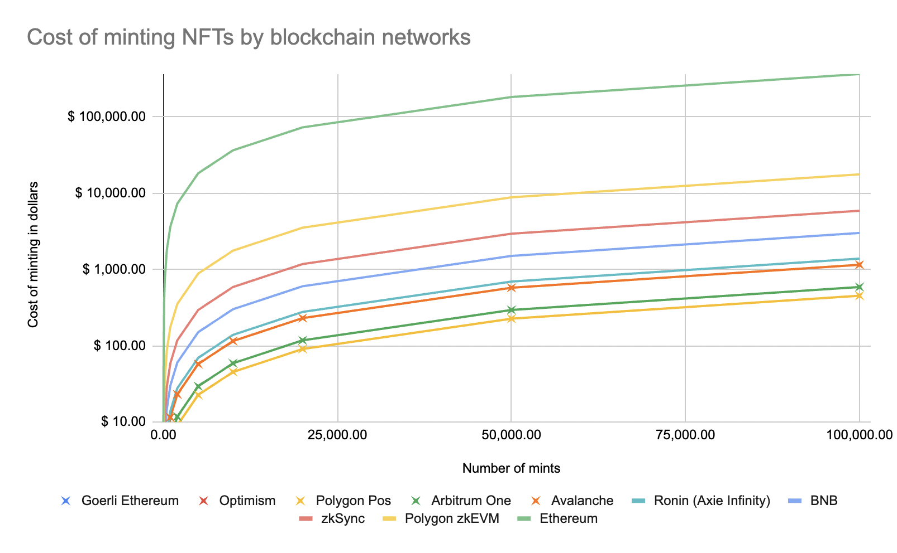

# 🖼️ NFT Mint Analysis

## Table of contents

- [Introduction](#introduction)
- [How to compute the mint cost of an NFT on an EVM-compatible chain?](#how-to-compute-the-mint-cost-of-an-nft-on-an-evm-compatible-chain)
- [Gaming company use case](#gaming-company-use-case)
- [Conclusion](#conclusion)

## Introduction

Initially, the analysis was initiated with an ambiguous request: "We want to know the capacity of the Polygon PoS blockchain." Although this statement can have various interpretations, it typically refers to the maximum number of transactions per second (TPS) that the blockchain network can process.

Capacity is a crucial factor in determining the scalability of a blockchain, which refers to its ability to handle a growing number of users and transactions without experiencing slowdowns or congestion. As the number of users and transactions on a blockchain network increases, the demand for processing power and network bandwidth also increases, which can eventually exceed the network's capacity and lead to slower transaction times, higher fees, and other issues.

An approach to comprehending the capacity of our network would involve utilizing a practical scenario, such as a gaming firm that performs a certain quantity of NFT mints per day, while adhering to a budget. By examining the expenses associated with minting on various blockchain networks, we could establish the feasibility of the project and select the most suitable alternative for the company.

## How to compute the mint cost of an NFT on an EVM-compatible chain?

Minting an NFT involves recording unique digital content onto a blockchain network, which comes at a cost. Users need to pay fees to compensate the network's validators or miners for verifying and processing the transaction. The total cost of a transaction can be calculated by multiplying the gas units used by the transaction by the price of gas in gwei, converted to dollars, where the gas price depends on several factors, including:

1. **The blockchain network being used**: different blockchain networks have varying fees for minting NFTs. For example, Ethereum, one of the most popular blockchain networks for NFTs, has a fee referred to as "[gas](https://ethereum.org/en/developers/docs/gas/#what-is-gas)" that is based on the network's congestion and the complexity of the transaction. While Solana's fees are fixed and very low, typically less than a penny per transaction, thanks to its unique architecture, which allows it to process transactions in parallel and in a highly efficient manner.
2. **The size and complexity of the digital content**: the larger and more complex the digital content, the more resources it will require to add it to the blockchain network, resulting in a higher fee.
3. **The current market conditions**: during times of high demand, the fees may increase due to increased network congestion.

Taking into account all of these parameters, this yields the following relationship:

`cost_minting_nft_dollars = cost_mint_fn_gas_unit * gas_price_gwei * 10^-9 * token_price_dollars` where `10^-9` represents the conversion of Gwei into ETH.

### How many gas units does it cost to mint an NFT?

The gas cost of minting an NFT on Ethereum or any other EVM-compatible network is measured in "gas units", which represent the amount of computational work required to execute a transaction. Each operation on the EVM has a fixed gas cost associated with it, and the total gas cost of a transaction is the sum of the gas costs of all the operations that make up the transaction.

A simple mint function that adds a new token to a contract and updates the contract's storage may require a gas cost of around 32,000 to 176,000 gas units, while a more complex mint function that involves expensive calculations may require significantly more gas units. We took 33,000 gas units as a base.

As an example, let's consider four basic NFT smart contracts, implemented using the most popular ERC721 standards such as OpenZeppelin's [ERC721](https://github.com/OpenZeppelin/openzeppelin-contracts/blob/master/contracts/token/ERC721/ERC721.sol) standard, OpenZeppelin [ERC721Enumerable](https://github.com/OpenZeppelin/openzeppelin-contracts/blob/master/contracts/token/ERC721/extensions/ERC721Enumerable.sol), an extension to the ERC721 implementation with helper function and mappings, [ERC721A](https://github.com/chiru-labs/ERC721A/blob/main/contracts/ERC721A.sol) and [Solmate](https://github.com/transmissions11/solmate/blob/main/src/tokens/ERC721.sol), two gas-optimized versions of the ERC721 standard. These contracts involve adding a new token and updating the contract storage, which cost between 32,000 and 176,000 gas units.

Here is the gas cost of minting an NFT depending on the different contracts. To reproduce the numbers, you can use `make test` which will run forge tests under the hood.

| Contract                                                                 | Gas used for the 1st mint | Gas used for all the other mints | Difference (\*)       |
|--------------------------------------------------------------------------|---------------------------|----------------------------------|-----------------------|
| [ERC721A](src/ERC721A_NFT.sol)                                           | 101,324 gwei              | 32,724 gwei                      |                       |
| [Solmate](src/Solmate_NFT.sol)                                           | 81,520 gwei               | 32,820 gwei                      | +96 gwei (~ +$0.017)  |
| [OpenZeppelinERC721](src/OpenZeppelinERC721_NFT.sol)                     | 103,965 gwei              | 33,265 gwei                      | +541 gwei (~ +$0.97)  |
| [OpenZeppelinERC721Enumerable](src/OpenZeppelinERC721Enumerable_NFT.sol) | 175,583 gwei              | 122,783 gwei                     | +90,059 gwei (~ +$16) |

(\*): To calculate the cost difference in dollars, we took a gas price of 90 gwei and the price of ether around $2,000.

First, we can see that the first mint is the most expensive one, the following ones are 3 times cheaper. Indeed, when a smart contract is deployed for the first time, it requires more gas to be executed, as it involves more computation to set up the necessary data structures and initialize the contract's state.

Second, we can clearly say that `OpenZeppelinERC721Enumerable` is not a good competitor. Indeed, its implementation is wasteful, it eats up a lot of gas and wastes storage. Most NFT projects inherit the two contracts of OpenZeppelin [ERC721](https://github.com/OpenZeppelin/openzeppelin-contracts/blob/master/contracts/token/ERC721/ERC721.sol) and [ERC721Enumerable](https://github.com/OpenZeppelin/openzeppelin-contracts/blob/master/contracts/token/ERC721/extensions/ERC721Enumerable.sol) by laziness or because they simply copy/paste code from other projects but `ERC721Enumerable` is not necessary at all. Most of the time, the only function needed from `ERC721Enumerable` is `totalSupply` which can simply be implemented using a counter to track token ids which would reduce minting costs by around 70%. This contract is mentioned because it is used [here](https://gradefi.com/nftcost) to compute the cost of minting an NFT on various blockchains even though it is not representative of the real cost of minting an NFT.

### How many dollars does it cost to mint an NFT?

We'd like to determine how much it costs to mint an NFT on different networks such as Ethereum, Polygon PoS, Polygon zkEVM, etc, based on different parameters such as network congestion (gas price) and token price. For example, if the gas price is 50 Gwei (1 Gwei = 0.000000001 ETH) and the transaction uses 33,000 gas units, the cost of the transaction would be 0.005 ETH (`33000 gas units * 50 Gwei  * 0,000000001 ETH/Gwei = 0.00165 ETH` which gives around $3 if we take 1 ETH = $1876).

See the different [simulations](https://docs.google.com/spreadsheets/d/1_9Q4mjAuSerGAkaC6Skc4FWgRqJMzQMO7kpNnJLWz7o/edit?usp=sharing) on Ethereum, Polygon PoS, Polygon zkEVM, etc.

See the **NFT Mint Analysis** page of the spreadsheet.

Some interesting questions:

> **What happens if there's congestion on the network?**

This will result in a higher gas price and thus higher transaction fees. On the graph, it means to move on the abscissa axis to the right.

Here's an example, if the gas price is 50 Gwei and the price of 1 ETH is equal to $2000, it would cost around $3 to mint an NFT (`33000 gas units * 50 Gwei * 0,000000001 ETH/Gwei * 2000 ETH/USD = $3.3`). Now there's a lot of demand because of a hype NFT mint on the chain and the gas price is multiplied by 10 to 500 Gwei. The cost of minting an NFT will also be multiplied by 10, around $33 (`33000 gas units * 500 Gwei * 0,000000001 ETH/Gwei * 2000 ETH/USD = $33`).

> **What happens if ETH or MATIC token value goes up?**

The cost of minting an NFT will likely increase, even if the gas price remains the same. On the graph, it means to move on the ordinate axis upwards.

Let's take a quick example if the gas price is 100 Gwei and the price of 1 ETH is equal to $2000, it would cost around $7 to mint an NFT (`33000 gas units * 100 Gwei * 0,000000001 ETH/Gwei * 2000 ETH/USD = $6.6`). Now if the price of ETH increases by 1,5 meaning that 1 ETH is equal to $3000, the cost of minting an NFT with the same gas price will also be multiplied by 1,5, around $10 (`33000 gas units * 100 Gwei * 0,000000001 ETH/Gwei * 3000 ETH/USD = $9.9`).

## Gaming company use case

Returning to our use case of a gaming company like [Axie Infinity](https://axieinfinity.com/) or [Gods Unchained](https://godsunchained.com/), the cost of minting NFTs plays a critical role in the sustainability of the game. Those games are based on different mechanisms such as minting, breeding, collecting, trading, etc. If the cost of minting becomes too high, players may abandon the game, leading to reduced profitability and the possible discontinuation of the game. This underscores the importance of selecting the appropriate blockchain network for the game. Moreover, some networks such as Polygon Pos produce a greater number of blocks per minute, which is more suitable for real-time games but let's not get into that.

Here's a [comparison](https://dune.com/leovct/nft-mint-analysis) of the average minting cost of 10k NFTs between different EVM blockchains over the last 3 months using [Dune Analytic](https://dune.com/home)'s databases.

By utilizing the **Mint Cost Calculator** provided with the spreadsheet, it becomes straightforward to compute the current cost of minting an NFT on each blockchain network. Let's imagine that these gaming companies target thousands or ten of thousands mints per day. Which chain would be the most suitable for such companies?

See the **Gaming Company Use Case** page of the spreadsheet.

As we can see, Ethereum and Polygon zkEVM are not suitable for such use cases. Indeed, it would cost 1215 times more to mint NFTs on Ethereum than on Polygon PoS, Avalanche or Arbitrum. Regarding Polygon zkEVM, fees are high at the moment because of the zero-knowledge proofs computations. With more users, such costs are expected to decrease.

Polygon PoS and Arbitrum seem like the best solutions for our gaming company. Let's take the example of a regular user who mints 10 NFTs per day, it would cost him around $0,06. A more advanced user would potentially mint around 100 NFTs per day which would cost around $0,6, which is also very cheap.

## Conclusion

Based on this analysis, we can conclude that the cost of minting NFTs on different blockchain networks can vary significantly. For a gaming company or any other entity that plans to mint a large number of NFTs, it's crucial to choose the right blockchain network to minimize costs and ensure the sustainability of the project. In this particular case, Polygon PoS seems like one of the most suitable options due to its low fees and high throughput. In the case of network congestion or a surge in MATIC price, users would need to pay more in MATIC to cover the gas fees but the impact on users may still be relatively low compared to other networks due to the low base fees on the Polygon network.
