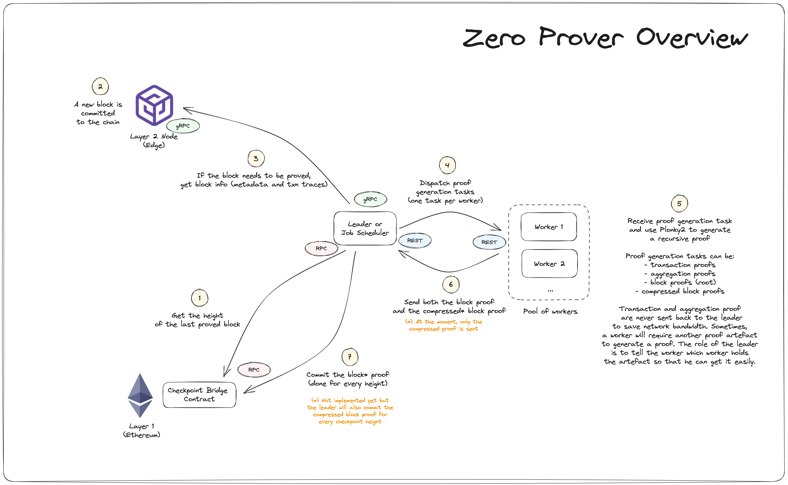
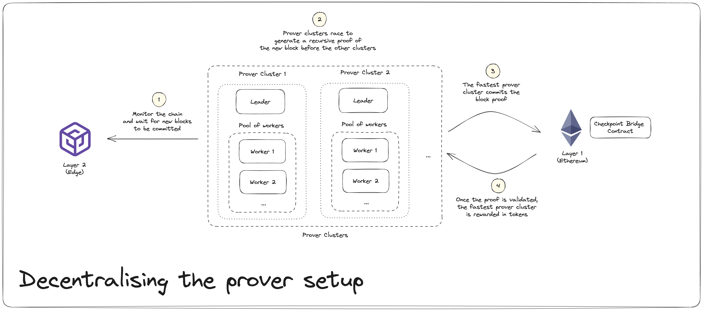
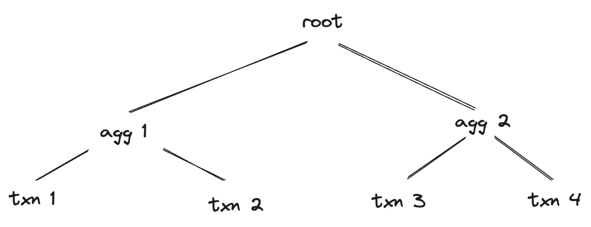

# ⚙️ Zero Prover Overview

## Table of contents

- [Introduction](#introduction)
- [Architecture Diagrams](#architecture-diagrams)
- [Proof Overview](#proof-overview)

## Introduction

The [zero-prover](https://github.com/mir-protocol/zero-provers) is a component that leverages the power of the [Plonky2](https://github.com/mir-protocol/plonky2) zero-knowledge proving library to generate recursive proofs of blocks.

One of the main use cases is the zero-prover monitors a Layer 2 chain and generates recursive block proofs for any new block. It then commits the proofs to a contract on the Layer 1 chain, probably Ethereum. The use case has been simplified a little bit to make it easier to grasp but you can take a look at the diagrams below to understand the system in details.

## Architecture Diagrams

The [excalidraw](https://excalidraw.com/) source file can be found under `doc/zero-prover.excalidraw`.

  

  

## Proof overview

A block is made of a list of transactions. In order to generate a recursive block proof, we need to generate proofs for every transaction before aggregating those proofs two by two until we get a final root proof.

  

Proofs can either be optimised to be generated fast or validated fast. For example, transaction and aggregated proofs are quick to generate but slow to validate. The block proof is optimised to be quick to validate so that it is easier for anyone to check that the state of our Layer 2 chain is valid.
